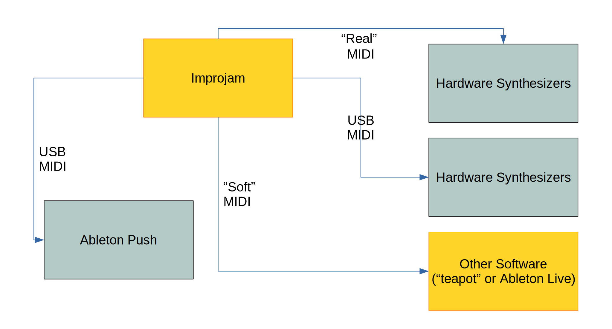

<h1>What is {live:js}?</h1>

Our show for [RefreshConf](https://www.refreshconference.nl/) 2019 in Groningen was split into two parts:

- 20 mins [performance](#performance) to end lunch and get people back to the stage
- 30 mins [talk](#talk) to explain what LiveJS is and which influence it has on the environment

---

- [Performance](#performance)
  - [Jan (Music)](#jan-music)
  - [Tim (Visual & Light)](#tim-visual--light)
- [Talk](#talk)
  - [Slides](#slides)
  - [Resources](#resources)
  - [Sketch](#sketch)
- [Location](#location)
- [Thanks](#thanks)
- [Contribution](#contribution)

---

## Performance

### Jan (Music)

* [improjam](https://github.com/halfbyte/improjam) (Music)
* [teapot (SL 1201)](https://github.com/livejs/sl-1201) (Music)

### Tim (Visual & Light)

* [luminave](https://github.com/NERDDISCO/luminave) (Light / DMX512 / LEDs)
* [modV](https://modv.js.org) (Visuals)
* [WebUSB DMX512 Controller](https://medium.com/@timpietrusky/how-to-build-a-webusb-dmx512-controller-by-using-an-arduino-e0dd8efb7bf0)

---

## Talk

### Slides

You can access the [slides](https://livejs.github.io/what-is-livejs-refreshconf2019/) or the [speaker notes](https://livejs.github.io/what-is-livejs-refreshconf2019/?present=true) and use the arrow keys on your keyboard to navigate through them. 

### Resources

* [LiveJS website](https://livejs.network)
* [LiveJS @ Twitter](https://twitter.com/livejs_network)
* LiveJS-Crew
  * Ruth John (aka rumyra)
    * [Vizra](https://github.com/livejs/VizraVid) (Visuals)
    * [Twitter](https://twitter.com/rumyra)
    * [Generative Art Podcast](https://twitter.com/GenArtPodcast)
  * Tim Pietrusky (aka NERDDISCO)
    * [luminave](https://github.com/NERDDISCO/luminave) (Light / DMX512 / LEDs)
    * Profile @ Scuttlebutt: `@8eEwSaZ1fbfOTiyxLtrSkUBWcwxPrkvFwsAVg5Fy3Kc=.ed25519`
    * [Twitter](https://twitter.com/TimPietrusky)
    * [NERDDISCO @ GitHub](https://github.com/NERDDISCO/)
    * [NERDDISCO @ Twitter](https://twitter.com/NERDDISCO)
  * Martin Schuhfuss (aka usefulthink)
    * [fivetwelve](https://github.com/beyondscreen/fivetwelve) (Light / DMX512)
    * [Twitter](https://twitter.com/usefulthink)
  * Matt McKegg (aka DESTROY WITH SCIENCE)
    * [loop drop (rust)](https://github.com/mmckegg/rust-loop-drop) (Music)
    * [loop drop (JS)](https://github.com/mmckegg/loop-drop-app) (Music)
    * Profile @ Scuttlebutt: `@FbGoHeEcePDG3Evemrc+hm+S77cXKf8BRQgkYinJggg=.ed25519`
    * [Twitter](https://twitter.com/MattMckegg)
    * [DESTROY WITH SCIENCE @ SoundCloud](https://soundcloud.com/destroy-with-science)
    * [Art~Hack Wellington](https://www.facebook.com/groups/714447698702058/)
    * [Scuttlebutt](https://scuttlebutt.nz)
  * Sam Wray (aka 2xAA & NOSIGNAL)
    * [modV](https://modv.js.org) (Visuals)
    * [Twitter](https://twitter.com/_2xAA)
    * [NOSIGNAL @ Twitter](https://twitter.com/_____nosignal)
    * [2xAA @ SoundCloud](https://soundcloud.com/2xaa)
    * [μCollective](https://ucollective.org/)
  * Jan Krutisch (aka halfbyte)
    * [improjam](https://github.com/halfbyte/improjam) (Music)
    * [teapot (SL 1201)](https://github.com/livejs/sl-1201) (Music)
    * [Twitter](https://twitter.com/halfbyte)
    * [halfbyte @ SoundCloud](https://soundcloud.com/halfbyte)
* Live Shows
  * [LiveJS @ JSConf EU 2017, Berlin (Germany)](https://www.youtube.com/watch?v=a0Bt7bK6nSA) (Performance at the LiveJS booth with a live remix of ["nested loops: People Got Mad"](https://www.youtube.com/watch?v=lCn-XCASn98))
  * [LiveJS Opening @ JSConf EU 2019, Berlin (Germany)](https://www.youtube.com/watch?v=o1rzsna263c&t=1222)
  * [LiveJS @ JSConf Asia 2019, Singapore](https://github.com/livejs/JSConfAsia-2019) (with links to videos to all performances)
* Environmental impact & ideas
  * [New map of the Netherlands for 2050 because of climate change](https://coastal.climatecentral.org/) (Normal high tide, moderate emission cuts, medium luck, mid range projections)
  * [Visual and Light Workshop](https://visualandlightworkshop.com)
  * [LiveJS Community on Slack (Invite)](https://join.slack.com/t/live-js/shared_invite/enQtNjI3ODEwMzg2MzU5LTA2NDgxZWVlMDk1OTc2ZTgxOWU5ZGVlZTQ0Y2Y1NDZjZjZkMGE3ZmY3NTU0MWI5ZTg5ZDgyMWM5ZDZlY2IxNzA)
  * [Extinction Rebellion](https://rebellion.earth/)
  * [Thorium](https://thoriumsim.com) (Space Ship Simulator)
  * [luminave-thorium](https://github.com/lumiave-thorium) (Thorium integration for luminave)
  * [Christa McAuliffe Space Center, Utah, USA](https://www.facebook.com/asdspacecenter/)

### Sketch

The talented [Anke](https://twitter.com/ankedesign) created a super nice sketch, thank you super much:

[Source](https://twitter.com/ankedesign/status/1192796584746074112)

---

## Location

Der Aa-Kerk, Groningen, Netherlands

---

## Thanks

We would like to thank [RefreshConf](https://www.refreshconference.nl/) and especially thank you to [Joël Kuijten](https://twitter.com/PM5544) for asking over and over until we said yes. And an even bigger thank you for letting us speak about what ever we wanted. 

---

## Contribution

See our [contribution guideline](.github/CONTRIBUTING.md). 

